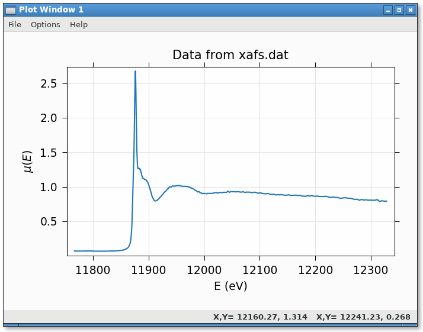
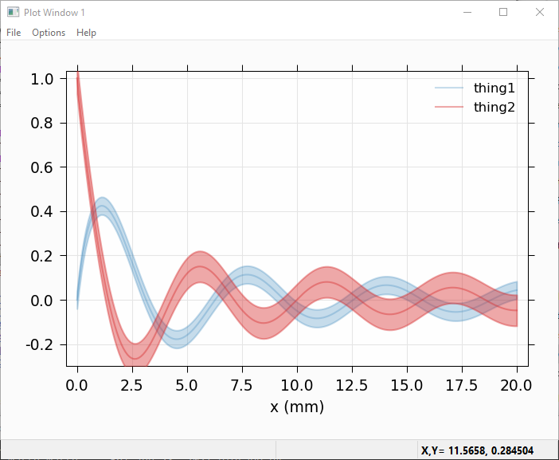
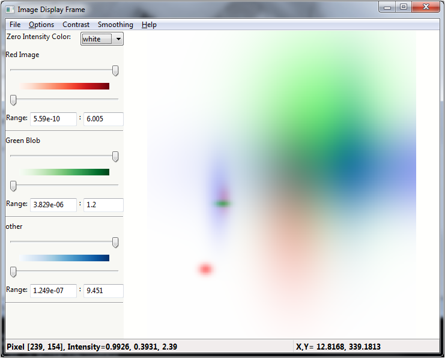

.. _ch_examples:

==========================================================
wxmplot Examples
==========================================================

The :ref:`ch_overview` showed a few illustrative  examples using `wxmplot`.
Here we show a few more examples.  These and more are given in the *examples*
directory in the source distribution kit.

.. _wxmplot examples: https://github.com/newville/wxmplot/tree/master/examples

Dynamic examples not shown here
----------------------------------

Several examples that can be found at `wxmplot examples`_ are not shown here
either because they show many plots or are otherwise more complex.  They are
worth trying out.

*demo.py* will show several Line plot examples, including a plot which uses
a timer to simulate a dynamic plot, updating the plot as fast as it can -
typically 20 to 30 times per second, depending on your machine.

*stripchart.py* also shows dynamic, time-based plot.

*scope_mode_function.py* and *scope_mode_generator.py* both
show dynamic plots with data uddated with a user-supplied function that either
returns or yields datasets to update plot traces.

*theme_compare.py* renders the same plot with a selection of different themes.

*image_scroll.py* shows an updating set of images on a single display.
Perhaps surprisingly, this can be faster than updating the line plots.

Scatterplot Example
-------------------------

An example scatterplot can be produced with a script like this:

.. literalinclude:: ../examples/scatterplot.py

and gives a plot (after having selected by "lasso"ing) that looks like this:

.. image:: images/scatterplot.png
   :width: 85 %

Plotting with errorbars
----------------------------

An example plotting with error bars:

.. literalinclude:: ../examples/errorbar.py

gives:

.. image:: images/errorbar.png
   :width: 85 %

Plotting data from a datafile
-----------------------------------------

Reading data with `numpy.loadtext` and plotting:

.. literalinclude:: ../examples/plot_fromdatafile.py

gives:

Using Left and Right Axes
----------------------------

An example using both right and left axes with different scales can be
created with:

.. literalinclude:: ../examples/leftright.py

and gives a plot that looks like this:

.. image:: images/two_axes.png
   :width: 85 %

Plotting with alpha-fill to show area under a curve
-----------------------------------------------------

It is sometimes desirable to fill the area below a curve, typically to 0.
Using the `alpha` value can be especially helpful for this, so that

.. literalinclude:: ../examples/fill_to_zero.py

will give:

.. image:: images/plot_alphafill_to_zero.png
   :width: 85 %

Plotting with alpha-fill to show uncertainty
-----------------------------------------------------

Another use of a filled band is to fill between two traces.  An important
use of this is to show uncertainties in a function, similar to showing
errorbars above.  If `dy` and `fill=True` are both given, then a band
between `y-dy` and `y+dy` will be filled, as with:

.. literalinclude:: ../examples/fill_uncertainties.py

which gives:

Of course, you can use that to recast showing a band between any two curves
by assigning the average of the 2 curves to `y` and half the difference to
`dy`, and perhaps setting `linewidth=0` to suppress showing the mean value.

Using `set_data_generator` for user-controlled, dynamic plotting
---------------------------------------------------------------------

There are two examples use :func:`set_data_generator` to specify how to update a
plot from a user-supplied function.  As seen in the two examples, the function
definied can either return data to update the data or use a Python geneator to
yiel the data.  In both cases, you first create a plot, and then set the
function for that plot window to call to grab new data.   The plot window will
call the function you pass in periodically, with a time (in milliseconds) given
by the `polltime` argument.  With a simple function, it might look like

.. literalinclude:: ../examples/scope_mode_function.py

As a second example, this time using a generator, you might do something like this:

.. literalinclude:: ../examples/scope_mode_generator.py

which will generate a plot like this:

.. video:: _static/scope_mode.mp4
   :alt: capture of images generated in scope mode.
   :muted:

Note that your function should return or yield a list of (x, y) pairs.

By way of comparison with the matplotlib example at
https://matplotlib.org/stable/gallery/animation/strip_chart.html, a similar
result can be generated with the somewhat shorter and less involved code
example

.. literalinclude:: ../examples/scope_mode_mpl_compare.py

Unlike with the matplotlib example, which mixes data generation and management
with plotting code, the :class:`Scope` here only generates the code, and
wxmplot functions handles all the plotting.  This code is both shorter and
better designed than the standard matplotlib example.

Displaying and image of a TIFF file
--------------------------------------

Reading a TIFF file and showing the image:

.. literalinclude:: ../examples/tiff_display.py

gives:

.. image:: images/tifffile_image.png
   :width: 85 %

3-Color Image
-----------------

If the data array has three dimensions, and has a shape of (NY, NX, 3), it
is assumed to be a 3 color map, holding Red, Green, and Blue intensities.
In this case, the Image Frame will show sliders and min/max controls for
each of the three colors.

.. literalinclude:: ../examples/rgb_image.py

giving a plot that would look like this:

.. image:: images/image_3color.png
   :width: 85%

Note that there is also an Image->Toggle Background Color
(Black/White) menu selection that can switch the zero intensity color
between black and white.  The same image with a white background looks
like:

This gives a slightly different view of the same data, with results that
may be more suitable for printed documents and presentations.
