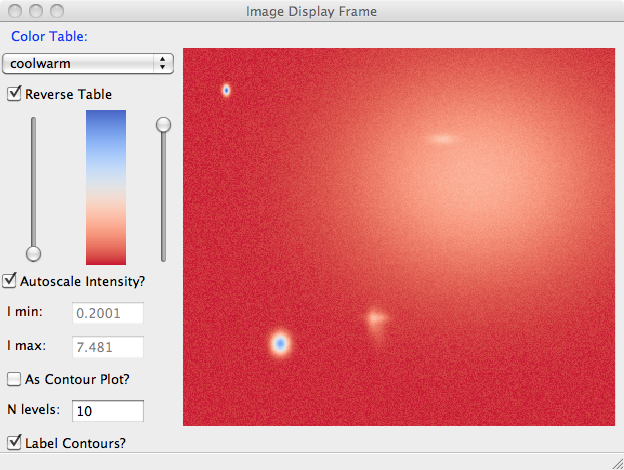

==========================================================
:class:`ImagePanel`:  A wx.Panel for Image Display
==========================================================

The :class:`ImagePanel` class supports image display (ie, gray-scale and
false-color intensity maps for 2-D arrays.  As with :class:`PlotPanel`,
this is derived from a :class:`wx.Panel` and so can be included in a wx GUI
anywhere a :class:`wx.Panel` can be.  While the image can be customized
programmatically, the only interactivity built in to the
:class:`ImagePanel` is the ability to zoom in and out.

In contrast, an :class:`ImageFrame` provides many more ways to manipulate
an image, and will be discussed below.

.. class:: ImagePanel(parent[, size=(4.5, 4.0)[, dpi=96[, messenger=None[, data_callback=None[, **kws]]]]])

   Create an Image Panel, a :class:`wx.Panel`

   :param parent: wx parent object.
   :param size:   figure size in inches.
   :param dpi:    dots per inch for figure.
   :param messenger: function for accepting output messages.
   :type messenger: callable or ``None``
   :param data_callback: function to call with new data, on :meth:`display`
   :type data_callback: callable or ``None``

   The *size*, and *dpi* arguments are sent to matplotlib's
   :class:`Figure`.  The *messenger* should should be a function that
   accepts text messages from the panel for informational display.  The
   default value is to use :func:`sys.stdout.write`.

   The *data_callback* is useful if some parent frame wants to know if the
   data has been changed with :meth:`display`.  :class:`ImageFrame` uses
   this to display the intensity max/min values.

   Extra keyword parameters are sent to the wx.Panel.

   The configuration settings for an image (its colormap, smoothing,
   orientation, and so on) are controlled through configuration
   attributes.

:class:`ImagePanel` methods
====================================================================

.. method:: display(data[, x=None[, y=None[, **kws]]])

   display a new image from the 2-D numpy array *data*.  If provided, the
   *x* and *y* values will be used for display purposes, as to give scales
   to the pixels of the data.

   Additional keyword arguments will be sent to a *data_callback* function,
   if that has been defined.

.. method: clear()

  clear the image

.. method: redraw()

  redraw the image, as when the configuration attributes have been changed.

:class:`ImageFrame`:  A wx.Frame for Image Display
==========================================================

In addition to providing a top-level window frame holding an
:class:`ImagePanel`, an :class:`ImageFrame` provides the end-user with many ways to
manipulate the image:

   1. display x, y, intensity coordinates (left-click)
   2. zoom in on a particular region of the plot (left-drag).
   3. change color maps.
   4. flip and rotate image.
   5. select optional smoothing interpolation.
   6. modify intensity scales.
   7. save high-quality plot images (as PNGs), copy to system clipboard, or print.

These options are all available programmatically as well, by setting the
configuration attributes and redrawing the image.

.. class:: ImageFrame(parent[, size=(550, 450)[, **kws]])

   Create an Image Frame, a :class:`wx.Frame`.

Image configuration with :class:`ImageConfig`
==============================================================

To change any of the attributes of the image on an :class:`ImagePanel`, you
can set the corresponding attribute of the panel's :attr:`conf`.   That is,
if you create an :class:`ImagePanel`, you can set the colormap with::

    import matplotlib.cm as cmap
    im_panel = ImagePanel(parent)
    im_panel.display(data_array)

    # now change colormap:
    im_panel.conf.cmap = cmap.cool
    im_panel.redraw()

    # now rotate the image by 90 degrees (clockwise):
    im_panel.conf.rot = True
    im_panel.redraw()

For a :class:`ImageFrame`, you can access this attribute as *frame.panel.conf.cmap*.

The list of configuration attributes and their meaning are given in the
:ref:`Table of Image Configuration attributes <imageconf_table>`

.. _imageconf_table:

Table of Image Configuration attributes:  All of these are members of the
*panel.conf* object, as shown in the example above.

  +----------------+------------+---------+---------------------------------------------+
  | attribute      |   type     | default | meaning                                     |
  +================+============+=========+=============================================+
  | rot            | bool       | False   | rotate image 90 degrees clockwise           |
  +----------------+------------+---------+---------------------------------------------+
  | flip_ud        | bool       | False   | flip image top/bottom                       |
  +----------------+------------+---------+---------------------------------------------+
  | flip_lr        | bool       | False   | flip image left/right                       |
  +----------------+------------+---------+---------------------------------------------+
  | log_scale      | bool       | False   | display log(image)                          |
  +----------------+------------+---------+---------------------------------------------+
  | auto_intensity | bool       | True    | auto-scale the intensity                    |
  +----------------+------------+---------+---------------------------------------------+
  | cmap           | colormap   | gray    | colormap for intensity scale                |
  +----------------+------------+---------+---------------------------------------------+
  | cmap_reverse   | bool       | False   | reverse colormap                            |
  +----------------+------------+---------+---------------------------------------------+
  | interp         | string     | nearest | interpolation, smoothing algorithm          |
  +----------------+------------+---------+---------------------------------------------+
  | xylims         | list       | None    | xmin, xmax, ymin, ymax for display          |
  +----------------+------------+---------+---------------------------------------------+
  | cmap_lo        | int        | 0       | low intensity percent for colormap mapping  |
  +----------------+------------+---------+---------------------------------------------+
  | cmap_hi        | int        | 100     | high intensity percent for colormap mapping |
  +----------------+------------+---------+---------------------------------------------+
  | int_lo         | float      | None    | low intensity when autoscaling is off       |
  +----------------+------------+---------+---------------------------------------------+
  | int_hi         | float      | None    | high intensity when autoscaling is off      |
  +----------------+------------+---------+---------------------------------------------+

Some notes:

1. *cmap* is an instance of a matplotlib colormap. 
2. *cmap_lo* and *cmap_hi* set the low and high values for the sliders that compress the
   colormap, and are on a scale from 0 to 100.  
3. In contrast, *int_lo* and *int_hi* set the map intensity values that are used when
   *auto_intensity* is ``False``.  These can be used to put two different maps on the
   same intensity intensity scale.   

Examples and Screenshots
====================================================================

A basic plot from a :class:`ImageFrame` looks like this:

This screenshot shows a long list of choices for color table, a checkbox to
reverse the color table, sliders to adjust the upper and lower level, a
checkbox to auto-scale the intensity, or entries to set the intensity
values for minimum and maximum intensity.  Clicking on the image will show
its coordinates and intensity value.  Click-and-Drag will select a
rectangular box to zoom in on a particular feature of the image.

The File menu includes options to save an PNG file of the image (Ctrl-S),
copy the image to the system clipboard (Ctrl-C), print (Ctrl-P) or
print-preview the image, or quit the application.   The Options menu
includes Zoom Out (Ctrl-Z), applying a log-scale to the intensity (Ctrl-L),
rotating the image clockwise (Ctrl-R), flipping the image top/bottom
(Ctrl-T) or right/left (Ctrl-F), or saving an image of the colormap.
The Smoothing menu allows you choose from one of several interpolation
algorithms.

