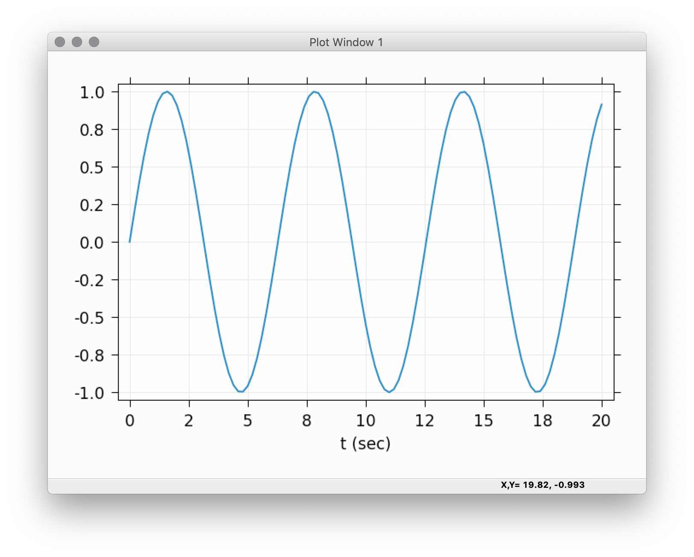
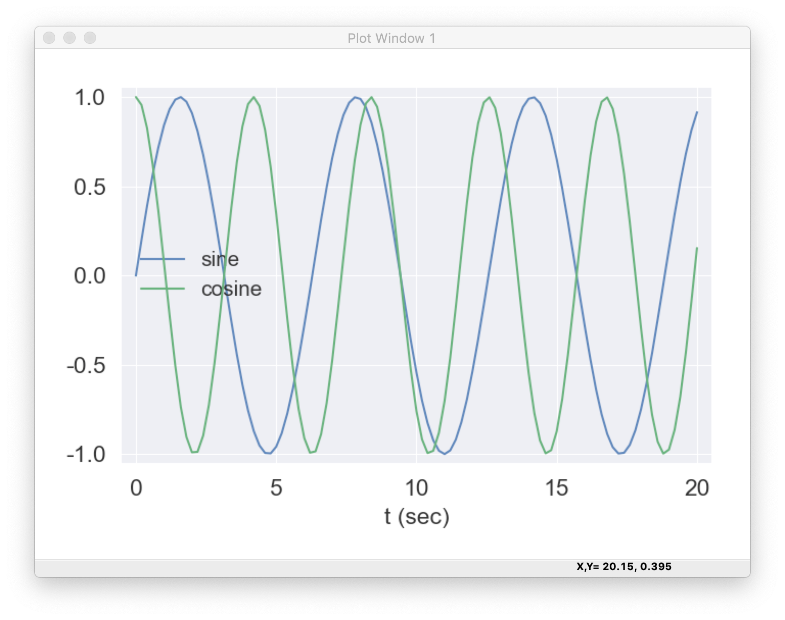

.. _ch_interactive:

==========================================================
Interactive wxmplot displays
==========================================================

.. module:: wxmplot.interactive

The :ref:`ch_overview` describes the main features of `wxmplot` and shows
how `wxmplot` plotting functions give a richer level of customization and
interactivity to the end user than is available from the standard
`matplotlib.pyplot`.  Here, the emphasis is on the immediacy of the
interactivity of the data displays especially when used from interactive
sessions.  An important feature of the :func:`plot`, :func:`imshow` and
other functions of the :mod:`interactive` module is that they display their
results immediately, without having to execute a `show()` method to render
the display. For interactive work from the Python (or one of the Jupyter
consoles or notebook) prompt, the displayed windows do not block the Python
session.  This means that not only can you zoom in, change themes, etc from
the Plot window, you can can also easily plot other functions or data,
either on the same window or in a new top-level plotting window.

While `wxmplot` provides :func:`plot`, :func:`imshow` and other functions
that are roughly equivalent to the functions from `matplotlib.pyplot`, the
functions are here not exact drop-in replacements for the `pyplot` functions.
For one thing, there are many missing plot types and functions.  For another,
the syntax for specifying options is different.  For example, `wxmplot`
prefers a long list of keyword arguments to :func:`plot` over a series of
separate function calls.

The functions in the :mod:`interactive` are described in detail below.

Plotting in an interactive session
===========================================================

As an example using :mod:`wxmplot.interactive` in a Jupyter-qtconsole
session might look like this::

    Jupyter QtConsole 4.5.4
    Python 3.7.4 (default, Aug 13 2019, 20:35:49)
    Type 'copyright', 'credits' or 'license' for more information
    IPython 7.7.0 -- An enhanced Interactive Python. Type '?' for help.

    In [1]: import numpy as np

    In [2]: import wxmplot.interactive as wi

    In [3]: x = np.linspace(0, 20, 101)

    In [4]: wi.plot(x, np.sin(x), xlabel='t (sec)')
    Out[4]: <wxmplot.interactive.PlotDisplay at 0x10db88678>

    In [5]:

At this point a plot like this will be displayed:

As with using `%matplotlib notebook` in a Jupyter notebook, the `wxmplot`
display can be zoomed in and out, but as shown in :ref:`ch_overview`, it
can also be configured and updated in many more ways.

For example, from the Plot Configuration window we could change the theme
to 'Seaborn' and set the label for this trace to be 'sine'.  Then from the
Jupyter console we can continue::

    In [5]: wi.plot(x, np.cos(1.5*x), label='cosine', show_legend=True)
    Out[5]: <wxmplot.interactive.PlotDisplay at 0x10db88678>

    In [6]:

which will now show:

which is again a fully interactive and configurable display. For example,
with the legend displayed, clicking on any of the labels in the legend will
toggle the display of that curve.  If we want to clear the data and plot
something new, we might do something like::

    In [6]: wi.plot(x, x*np.log(x+1), label='xlogx', new=True)
    Out[6]: <wxmplot.interactive.PlotDisplay at 0x10db88678>

    In [7]:

We can also place a text string, arrow, horizontal, or vertical line on the
plot, as with::

    In [7]: wi.plot_text('hello!', 9.1, 0.87)

    In [8]:

and so forth.

If we wanted to bring up a second 2D Line Plot window, we can use the
**win=2** option::

    In [8]: wi.plot(x, np.sin(x)*np.exp(-x/8) , win=2, theme='ggplot')
    Out[8]: <wxmplot.interactive.PlotDisplay at 0x110b2fb88>

    In [9]:

and then control which of the displays any additional plot functions use by
passing the `win` option to the plotting functions.

The immediacy of the rendering and the ability to customize the plots makes
these plotting functions well-suited for exploratory displays of data.

Using the :mod:`interactive` functions from a script
===========================================================

When using the :mod:`interactive` functions by running a script in a
non-interactive way, the display will still appear. It does not block
further execution of the script and the display does not disappear when the
script is complete.  Instead, the plots and images will remain displayed
and fully operational until all windows have been closed or until the
running script is explicitly closed with Crtl-C.  That means that you can
add `wi.plot()` and `wi.imshow()` to your short- or long-running scripts
and the plots will be displayed until you no longer want to use them.

2D Plotting with :func:`plot` and related functions
==========================================================================

.. autofunction:: plot

More details of Plot Options are given in
:ref:`Table of Plot Arguments <plotopt_table>`.

.. autofunction:: hist

.. autofunction:: update_trace

.. autofunction:: plot_setlimits

.. autofunction:: plot_text

.. autofunction:: plot_arrow

.. autofunction:: plot_marker

.. autofunction:: plot_axhline

.. autofunction:: plot_axvline

Displaying images with :func:`imshow` and :func:`contour`
==============================================================

.. autofunction:: imshow

.. autofunction:: contour

Functions for working with the interactive windows
======================================================

.. autofunction:: set_theme

.. autofunction:: available_themes

.. autofunction:: get_wxapp

.. autofunction:: get_plot_window

The returned :class:`wx.PlotFrame` will have the heirarchy of attributes
described in the table below.  This allows access to the underlying
matplotlib Axes and Canvas objects.

.. _plotframe_objects_table:

**Table of PlotFrame attributes**

  +-----------------+-----------------------------------------------------+
  | name            |  object type                                        |
  +=================+=====================================================+
  | .panel          | wxmplot.PlotPanel, a wx.Panel                       |
  +-----------------+-----------------------------------------------------+
  | .panel.conf     | wxmplot.PlotConfig                                  |
  +-----------------+-----------------------------------------------------+
  | .panel.axes     | matplotlib.axes.AxesSubPlot                         |
  +-----------------+-----------------------------------------------------+
  | .panel.fig      | matplotlib.figure.Figure                            |
  +-----------------+-----------------------------------------------------+
  | .panel.canvas   | matplotlib.backends.backend_wxagg.FigureCanvasWxAgg |
  +-----------------+-----------------------------------------------------+

.. autofunction:: get_image_window

As with :class:`wx.PlotFrame`, the returned :class:`wx.ImageFrame` will
have the same principle attributes to access the matplotlib Axes and Canvas
objects.
