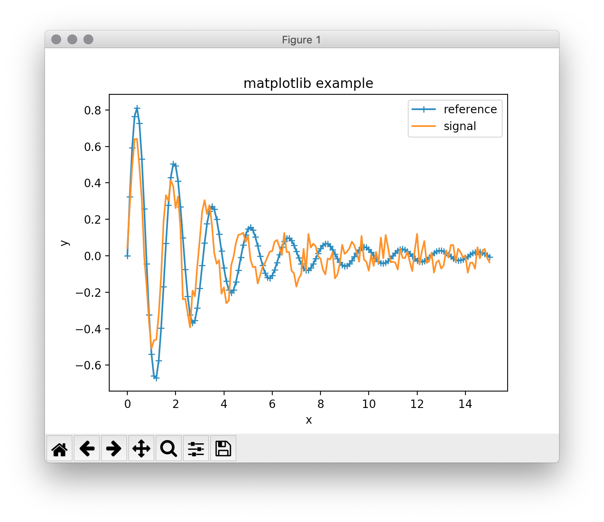

.. _ch_overview:

==========================================================
Overview:
==========================================================

.. module:: wxmplot

`wxmplot` provides simple functions for making 2D plots and displaying
image data.  It is not easy to convey the interactivity in a static
document, but I will try.

Let's start with a simple script using  :mod:`matplotlib.pyplot`::

    #!/usr/bin/python
    import numpy as np
    x = np.linspace(0.0, 15.0, 151)
    y = 5*np.sin(4*x)/(x*x+6)
    z = 4.8*np.sin(4.3*x)/(x*x+8) + np.random.normal(size=len(x), scale=0.05)

    import matplotlib.pyplot as plt
    plt.plot(x, y, '-+', label='reference')
    plt.plot(x, z, '-', label='signal')
    plt.title('matplotlib example')
    plt.xlabel('x')
    plt.ylabel('y')
    plt.legend()
    plt.show()

which is pretty straight-forward and produces a plot like this (depending
somewhat on the backend being used):

From this screen, moving the mouse around updates the display of x and y
values displayed to those of the mouse.  Clicking on the magnifying glass
icon and then clicking and dragging a box to zoom in.  allows the user to
zoom in on portions of the plot.  Clicking on the icon with 4 arrows allows
the user to pan to other parts of the data range.  Clicking on the icon
with 3 bars (equalizer?) allows the user to adjust the plot margins. The
diskette icon allows the user to save a PNG file of the plot display.  For
some use-cases, this amount of interaction is sufficient.

By selecting a particular GUI toolkit, `wxmplot` aims to give more
interaction, more flexibiity than the generic `maplotlib` display.  With
`wxmplot`, that script would be rewritten as::

    #!/usr/bin/python
    import numpy as np
    x = np.linspace(0.0, 15.0, 151)
    y = 5*np.sin(4*x)/(x*x+6)
    z = 4.8*np.sin(4.3*x)/(x*x+8) + np.random.normal(size=len(x), scale=0.05)

    from wxmplot.interactive import plot
    plot(x, y, label='reference', marker='+', xlabel='x', ylabel='y',
         title='wxmplot example', show_legend=True)
    plot(x, z, label='signal')

and yield a similar plot:

.. image:: images/wxmplot_basic.png
   :width: 75 %

As with the `pyplot` example, moving the mouse around updates the display
of x and y values displayed to those of the mouse.  To zoom in on a region,
the user can click and drag to draw a box to zoom in.  The Navigation
Toolbar is gone, but there are more options for configuring the plot from
the File and Options menus, as will be described in the next section.

Also, note that in the `wxmplot` example, there was no `show()` function
issued.  As will be discussed more in :ref:`ch_interactive`, the `plot`
functions display their results immediately, without the need for a
blocking function such as `show()`.

User Interaction and Configuring 2D line plots
==================================================

All `wxmplot` 2D plots support a few basic user interactions.  First, as
mentioned above, the user can zoom in by drawing a box: Clicking the left
mouse button and dragging will draw a rectangular box, and releasing the
mouse button will zoom in to that rectangle.  This can be repeated multiple
time to continue zooming in. Typing "Ctrl-Z" (or "Apple-Z" for Mac OS X)
will zoom out to the previous zoom level, or until the show the full plot.

A second important user interaction is that when the Plot Legend is
displayed, clicking on the Legend entry for any trace will toggle whether
that trace is displayed. For the example above with only two traces this
may not be so important, but this ability to easily turn on and off traces
can be very useful when many traces are displayed.

Right-clicking within the Axes (that is the part of the Frame showing the
Data) will show a pop-up window that allows the user to quickly Unzoom,
Display the Plot Configuration Window, or Save the Image.

Each Plot Window will have a File menu, an Option menu, and a Help menu
that gives even more functionality, and a series of Ctrl-Letter bindings to
use as shortcuts to Menu selections.  From the File menu, the user can:

   * Save an image of the plot to a PNG file [Ctrl-S]
   * Copy the image to system clipboard so that it can be pasted into other applications [Ctrl-C].
   * Export the data in the plot to a plain text file [Ctrl-D]
   * Setup and preview printing.
   * Print the image [Ctrl-P]

From the Options menu, the user can:

   * Display the Plot Configuration Window to configure nearly any aspect ofthe Plot [Ctrl-K]
   * Un-Zoom all to the full data range [Ctrl-Z]
   * Toggle whether the Legend is displayed [Ctrl-L]
   * Toggle whether the Grid is displayed [Ctrl-G]
   * Select whether the X and Y Axes are Linear or Log Scale.
   * Perform some simple data transformations, to show :math:`dy/dx`, :math:`yx`, :math:`yx^2`, :math:`y^2`, :math:`\sqrt{y}`, or :math:`1/y`.

The Help menu will display a quick cheat-sheet to remind you of some of
these command options.

An important tool for configuring and customizing plots is the *Plot
Configuration Window*.  This is a tabbed window with 4 panels to allow the
user to configure essentially every aspect of the plot:

    * Colors and Line Properties
    * Ranges and Margins
    * Text, Labels, and Legend
    * Scatterplot displays

with these configuration settings, anyone should be able to create
beautiful presentation-quality image of their data.

Color and Line Properties
~~~~~~~~~~~~~~~~~~~~~~~~~~~~~~~

The **Colors and Line Properties** tab of the *Plot Configuration Window*
allows the user to configure the basic colors for the plot.  This includes
setting the plotting Theme.  Each of the themes available (there are more
than 25 themes available, about half of them derived from the set of themes
from Seaborn) will reset all the default colors for the plot components and
for each line trace, and many of the resource settings of `matplotlib`.
The themes and their color selections are carefully chosen and aim to make
pleasing and informative color choices, some with special attention to
color-blindness.

The user can change the colors for Text, Grid, Background, and Outer Frame,
and select whether the Grid is shown, whether the Legend is Shown, and
Whether the Top and Right Axes Spines are shown. The user can also set the
following attributes for each trace: the label, color, line style, line
width, symbol to use for a marker, marker size, z-order, and join style for
each trace drawn can be customized.

.. image:: images/PlotConfig_LineProps.png
   :width: 95 %

Ranges and Margins Properties
~~~~~~~~~~~~~~~~~~~~~~~~~~~~~~~~~~~~

The **Ranges and Margins** tab allows the user to change the display data
ranges and the outer margins of the plot.  Here, the user can alsoe select a
Linear or Log scale for the X and Y axes.

The user can also set the Plot Boundaries -- exact X and Y ranges to show
for the plot, or use the values of the data range.  By default, the data
range is padded by a few percent so that all the data is fully displayed.
The user can change the "padding percentage", or explicitly set each of the
view limits.

Finally, the user can finely adjust the margins around the plot. By default
these are chosen to give a small but noticeable empty space around the edge
of the plot. If the user wants the Plot Legend to be off to the side or on
top of the plot, they may need to adjust these margins.

.. image:: images/PlotConfig_Ranges.png
   :width: 95 %

Text Properties
~~~~~~~~~~~~~~~~~~~~~~~~~~~~~~~~~~~~

The **Text and Labels** tab allows the user to set the title and labels for
the X and Y axes, and to adjust the fontsize for these text and the text
shown in the plot legend.  Here, the Legend can also be customized: whether
it is shown, it's location, and whether the legend entries can be clicked
on to toggle the display of the corresponding line.

.. image:: images/PlotConfig_Text.png
   :width: 95 %

ScatterPlot Properties
~~~~~~~~~~~~~~~~~~~~~~~~~~~~~~~~~~~~

The **Scatterplot** tab allows the user to set the colors and marker sizes
for scatter plots.

.. image:: images/PlotConfig_Scatter.png
   :width: 95 %

Displaying images with :func:`imshow` and :func:`contour`
==============================================================

#
# .. autofunction:: imshow
#
# .. autofunction:: contour
#
# Functions for working with the interactive windows
# ======================================================
#
# .. autofunction:: get_wxapp
#
# .. autofunction:: set_theme
#
# .. autofunction:: available_themes
#
# .. autofunction:: get_plot_window
#
# .. autofunction:: get_image_window
