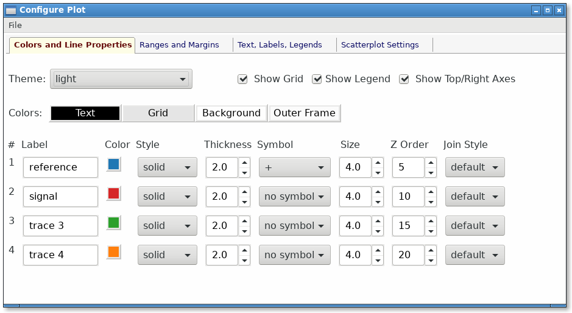
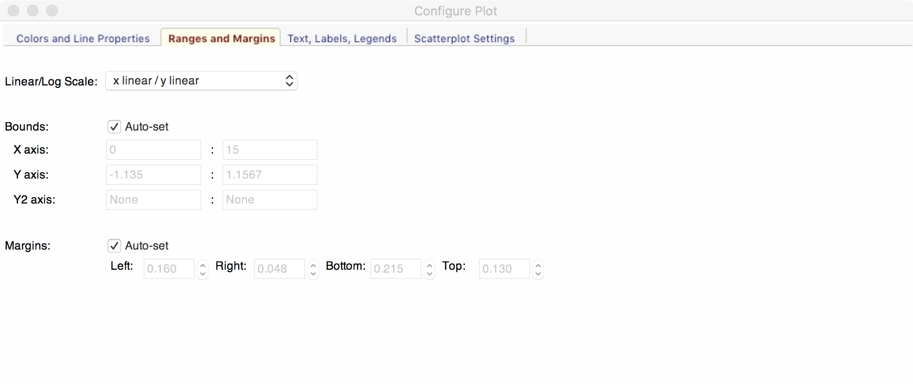
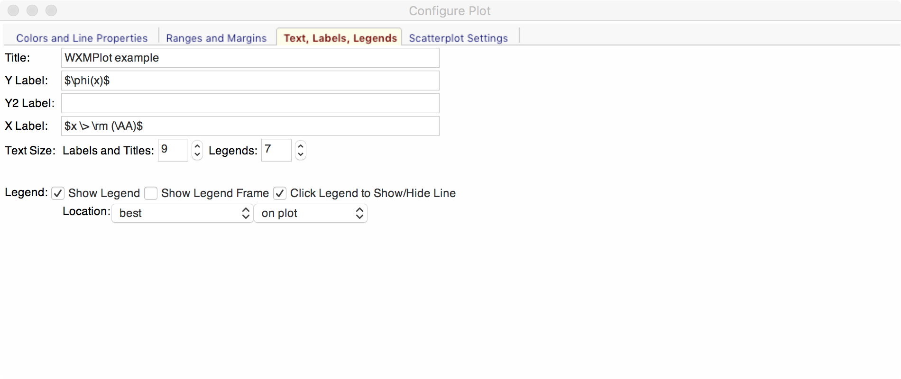
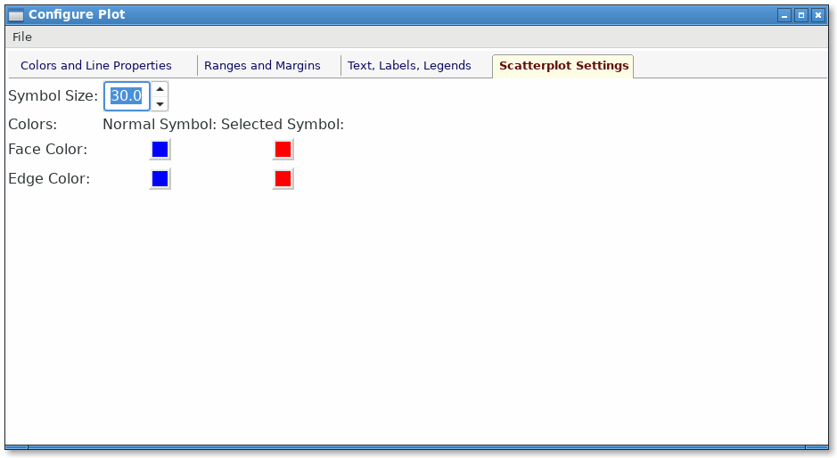
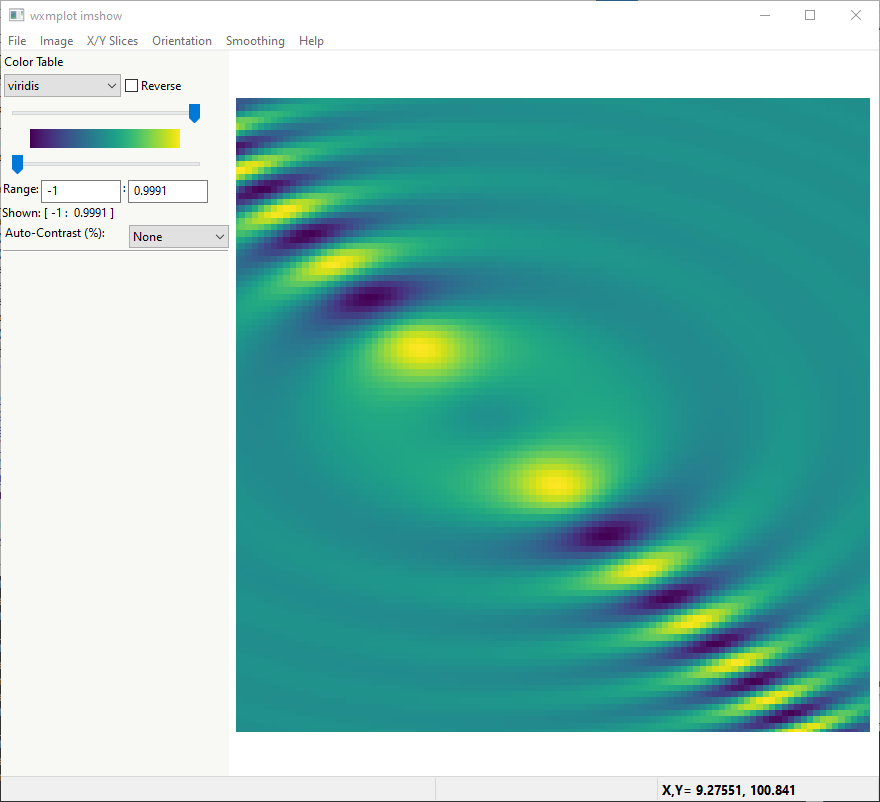
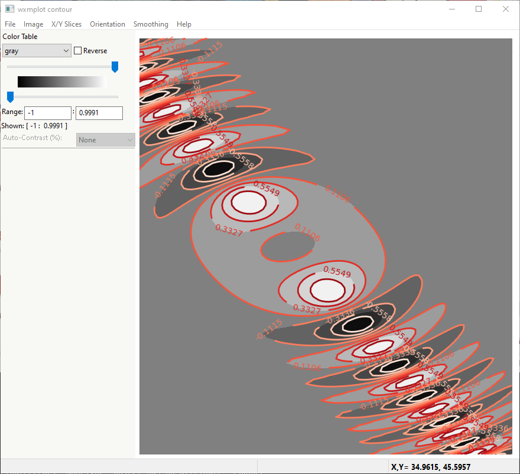
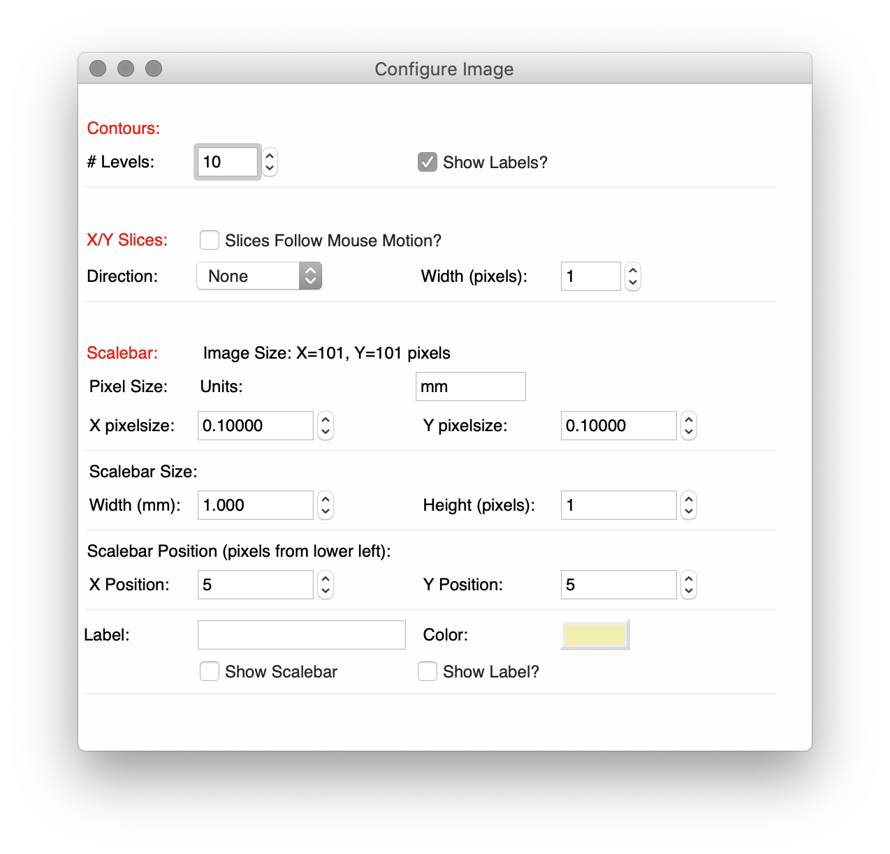

.. _ch_overview:

==============================
wxmplot Overview
==============================

.. module:: wxmplot

`wxmplot` provides simple functions for making 2D line plots and displaying
image data.  These are similar to the simplest functions from
`matplotlib.pyplot`, but offer richer interactivity and customization.  It
is not easy to convey interactivity in a static document, but here and in
:ref:`ch_interactive`, we will try to show how easy it is to use `wxmplot`
for exploratory data analysis.

2D Line Plots with :func:`plot`
===============================

Let's start with a simple script using  :mod:`matplotlib.pyplot`::

    #!/usr/bin/python
    import numpy as np
    x = np.linspace(0.0, 15.0, 151)
    y = 5*np.sin(4*x)/(x*x+6)
    z = 4.8*np.sin(4.3*x)/(x*x+8) + np.random.normal(size=len(x), scale=0.05)

    import matplotlib.pyplot as plt
    plt.plot(x, y, '-+', label='reference')
    plt.plot(x, z, '-', label='signal')
    plt.title('matplotlib example')
    plt.xlabel('x')
    plt.ylabel('y')
    plt.legend()
    plt.show()

This is a pretty straight-forward matplotlib script and produces a plot as
shown on the left (depending a bit on the backend and OS):

.. _plotcompare:

    .. image:: images/plot_mpl.png
       :width: 45%
    .. image:: images/plot_wxmplot.png
       :width: 52%

From the matplotlib plot, moving the mouse around updates the x and y
values displayed to match the location of the mouse.  Clicking on the
magnifying glass icon and then clicking and dragging a box allows the user
to zoom in on portions of the plot.  Clicking on the icon with 4 arrows
allows the user to pan to other parts of the data range.  Clicking on the
icon with 3 bars allows the user to adjust the plot margins. The diskette
icon allows the user to save a PNG file of the plot display.

With `wxmplot`, that script would be rewritten as::

    #!/usr/bin/python
    import numpy as np
    x = np.linspace(0.0, 15.0, 151)
    y = 5*np.sin(4*x)/(x*x+6)
    z = 4.8*np.sin(4.3*x)/(x*x+8) + np.random.normal(size=len(x), scale=0.05)

    import wxmplot.interactive as wi
    wi.plot(x, y, label='reference', marker='+', xlabel='x', ylabel='y',
            title='wxmplot example', show_legend=True)
    wi.plot(x, z, label='signal')

and yields the plot shown on the right above.  There are some stylistic
differences, but the point so far is that the results are very similar.

`Wxmplot` gives more interaction and flexibility than the `matplotlib`
display, and without cluttering the display with little icons.  As with the
`pyplot` example, moving the mouse around updates the display of x and y
values displayed to those of the mouse.  To zoom in on a region, the user
simply clicks and drag to draw a box to zoom in.  The Navigation Toolbar is
gone but there are options for saving the image and many more options for
configuring the plot from the File and Options menus.  These will be
described in more detail in the next section.

Note that in the `wxmplot` example, there was no `show()` function issued.
As will be discussed more in :ref:`ch_interactive`, the `wxmplot` functions
display results immediately when in an interactive session and allow
interaction at the shell to continue, without the need for a blocking
`show()` function.

In addition to the :func:`interactive.plot` function, there are several
more functions to augment 2D line plots, including those to add text,
arrows, lines, and markers to plots.  These and more functions are
discussed in detail in :ref:`ch_interactive`.

User Interaction and Configuring 2D line plots
==============================================

All `wxmplot` 2D line plots support a few basic user interactions.  First, as
mentioned above, the user can zoom in by drawing a box: Clicking the left
mouse button and dragging will draw a rectangular box, and releasing the
mouse button will zoom in to that rectangle.  This can be repeated multiple
time to continue zooming in. Typing "Ctrl-Z" (or "Apple-Z" for Mac OS X)
will zoom out to the previous zoom level, or until the show the full plot.

A second important feature is that when the Plot Legend is displayed,
clicking on the Legend entry for any trace will toggle whether that trace
is displayed. For the example above with only two traces this may not be so
important, but this ability to easily turn on and off traces can be very
useful when many traces are displayed.

Right-clicking within the Axes (that is the part of the Frame showing the
Data) will show a pop-up window that allows the user to quickly Unzoom,
Display the Plot Configuration Window, or Save the Image.

Each Plot Window will have a File menu, an Option menu, and a Help menu
that gives even more functionality, and a series of Ctrl-Key bindings to
use as shortcuts to Menu selections.  From the File menu, the user can:

   * Save an image of the plot to a PNG file [Ctrl-S]
   * Copy the image to system clipboard to paste into other applications [Ctrl-C].
   * Export the data in the plot to a plain text file [Ctrl-D]
   * Setup and preview printing.
   * Print the image [Ctrl-P]

From the Options menu, the user can:

   * Display the Plot Configuration Window [Ctrl-K]
   * Un-Zoom all to the full data range [Ctrl-Z]
   * Toggle whether the Legend is displayed [Ctrl-L]
   * Toggle whether the Grid is displayed [Ctrl-G]
   * Select whether the X and Y Axes use Linear or Log Scale.
   * Perform some simple data transformations to show :math:`dy/dx`, :math:`yx`, :math:`yx^2`, :math:`y^2`, :math:`\sqrt{y}`, or :math:`1/y`.

The Help menu will display a quick cheat-sheet to remind you of these
Ctrl-Key options.

The *Plot Configuration Window*  is an
important tool for configuring and customizing 2D line plots.  This is a
tabbed window frame with 4 panels to allow the user to configure
essentially every aspect of the plot:

    * Colors and Line Properties
    * Ranges and Margins
    * Text, Labels, and Legend
    * Scatterplot displays

with these configuration settings available, any user should be able to
create beautiful presentation-quality image from their data.

Color and Line Properties
-------------------------

The **Colors and Line Properties** tab of the *Plot Configuration Window*
allows the user to configure the basic colors for the plot.  This includes
setting the plotting theme.  Selecting any of the available themes (there
are more than 25 themes available, about half of them derived from Seaborn)
will reset all the default colors for the plot components and for each line
trace, and many of the resource settings of `matplotlib`.  The themes and
their color selections are carefully chosen to make pleasing and
informative color choices, some with special attention to color-blindness.

Aside from the theme choices, the user can change the colors for Text,
Grid, Background, and Outer Frame, and also select whether the Grid is
shown, whether the Legend is Shown, and whether the Top and Right Axes
Spines are shown. In addition, the user can set the any of the following
attributes for each trace: the label, color, line style, line width, symbol
to use for a marker, marker size, z-order, and join style for each trace
drawn.  Starting from the decent default values from the pre-defined
themes, this gives the user complete control of the plot display.

Ranges and Margins Properties
-----------------------------

The **Ranges and Margins** tab allows the user to change the display data
ranges and the outer margins of the plot.  Here, the user can also select a
Linear or Log scale for the X and Y axes.

The user can set the Plot Boundaries -- exact X and Y ranges for the plot,
or use the values of the data range.  By default, the range shown is the
data range padded by a few percent so that all the data is fully displayed.
The user can change the "padding percentage", or explicitly set each of the
view limits.

Finally, the user can fine-tune the margins around the plot. By default
these are chosen to give a small but noticeable empty space around the edge
of the plot. If the user wants the Plot Legend to be off to the side or on
top of the plot, they may need to adjust these margins.

Text Properties
---------------

The **Text and Labels** tab allows the user to set the title and labels for
the X and Y axes, and to adjust the font size for these text components.
Here, the details of the Legend can also be customized: whether it is
shown, its location, and whether the legend entries can be clicked on to
toggle the display of the corresponding line.

ScatterPlot Properties
----------------------

The **Scatterplot** tab allows the user to set the colors and marker sizes
for scatter plots.

Displaying images with :func:`imshow` and :func:`contour`
=========================================================

As for 2D line plotting, `wxmplot` has a simple :func:`interactive.imshow`
function that displays 2D image data and adds user-friendly controls to
manipulate and adjust the display of image data.  While
`matplotlib.pyplot.imshow()` has the basic user action of zooming and
saving image files, :func:`interactive.imshow` has interactions that are
specific to displaying false color images from 2D arrays on intensity
values.  An example using :func:`interactive.imshow` is::

    #!/usr/bin/python
    import numpy as np
    import wxmplot.interactive as wi

    y, x = np.mgrid[-5:5:101j, -4:6:101j]
    dat = np.sin(x*x/3.0 + y*y)/(1 + (x+y)*(x+y))

    wi.imshow(dat, x=x[0,:], y=y[:,0], colormap='viridis', wintitle='wxmplot imshow')

which will display the image and a control frame:

To display that image data as a contour plot, one can just replace
:func:`interactive.imshow` with :func:`interactive.contour`.  With the same
dataset but using::

    wi.contour(dat, x=x[0,:], y=y[:,0], colormap='gray', wintitle='wxmplot contour')

which will show:

In fact, the user can switch between showing the image data as a contour
from the Image menu or with Ctrl-N.

User Interaction and Configuring Image and Contour displays
===============================================================

As with the 2D line plots, clicking anywhere on the image will show the x, y,
and intensity values in the status bar.  If arrays for `x` and `y` values have
been passed in, both the indices and `x` and `y` values for the pixel selected
will be displayed.  Similarly, clicking and dragging will zoom in on a portion
of the image, a process that can be repeated indefinitely.

From the Image or Contour panel, a few display customizations are
immediately available. On the left hand side of the frame, there are a few
controls to adjust the displayed image.  First, the color lookup table for
intensity can be changed to any of about 30 pre-defined tables and can be
reversed.  Sliders and entry boxes allow the user to change the threshold
levels to adjust the contrast.  A simple and reproducible approach to
adjusting the contrast level is also provided: a drop-down list can be used
to select contrast percentage using the histogram of values in the image.
That is, selecting 'Auto-contrast %' of '1' will put the lowest color value
at the 1% percentile of intensities (that is the intensity such that 99% of
the pixels have a higher intensity) and the highest value at the 99%
percentile (that is the intensity such that 99% of the pixels have a lower
intensity).  Note that adjusting the contrast is disabled for contour
plots.

There are several Menus and Ctrl-key shortcuts available from the Image
Display Window to give more interaction.  From the File menu, the user can

   * Save an image of the plot to a PNG file [Ctrl-S]
   * Copy the image to system clipboard to paste into other applications [Ctrl-C].
   * Export the data in the plot to a plain text file [Ctrl-D]
   * Save an image of the current Color Map
   * Setup and preview printing
   * Print the image [Ctrl-P]

From the Image menu, the user can:

   * Zoom Out all to the full data range [Ctrl-Z]
   * Display an Image Configuration Window [Ctrl-K]
   * Enhance the Auto-Contrast Level [Ctrl-+]
   * Reduce the Auto-Contrast Level [Ctrl--]
   * Display the histogram of intensities [Ctrl-G]
   * Toggle whether the Axes Labels are displayed [Ctrl-A]
   * Toggle whether the image is displayed as a Contour Map [Ctrl-N]
   * Toggle whether a Scalebar is displayed [Ctrl-B]
   * Toggle whether a 3-color map uses a black or white background [Ctrl-W]

From the X/Y Slices menu, the user can control whether clicking on a pixel
on the image displays a X- or Y- slice through the image data as a 2D line
plot in a separate plotting window.  From this menu, the user can select:

   * Show No X/Y Slices
   * Show Slices in the X direction [Ctrl-X]
   * Show Slices in the Y direction [Ctrl-Y]
   * Toggle whether the displayed slice should update as the mouse is moved

From the Orientation menu, the user can rotate and flip the image:

   * Rotate clockwise by 90 degrees [Ctrl-R]
   * Flip Top and Bottom [Ctrl-T]
   * Flip Left and Right [Ctrl-F]
   * Reset Flip and Rotations to original data

From the Smoothing menu, the user can select one of more than a dozen
methods to smooth the data across pixels.

Finally, the Help menu will give a quick list of keyboard shortcuts.

Image Configuration Window
-----------------------------

Most of options for working with images and contour maps can be found from
the main window or menu selections. The Image Configuration Window has a
few additional options and values that can be set by the user:

For contour plots, the user can select the number of levels to show and
whether the contour line will show intensity values.

For the X/Y slices, the user can select which slice is shown and also
whether the slice shown sums over more than one pixel across the dimension
chosen.  This may be useful for smoothing out noisy images.

More options are available to control whether a Scalebar is displayed on the
image, and how that is set up.  Here, the user can update the pixel size in
the units of their choice, and set the size of the scalebar in their units.
The position and color of the scalebar can also be set, and text to go below the
scalebar can be entered.
