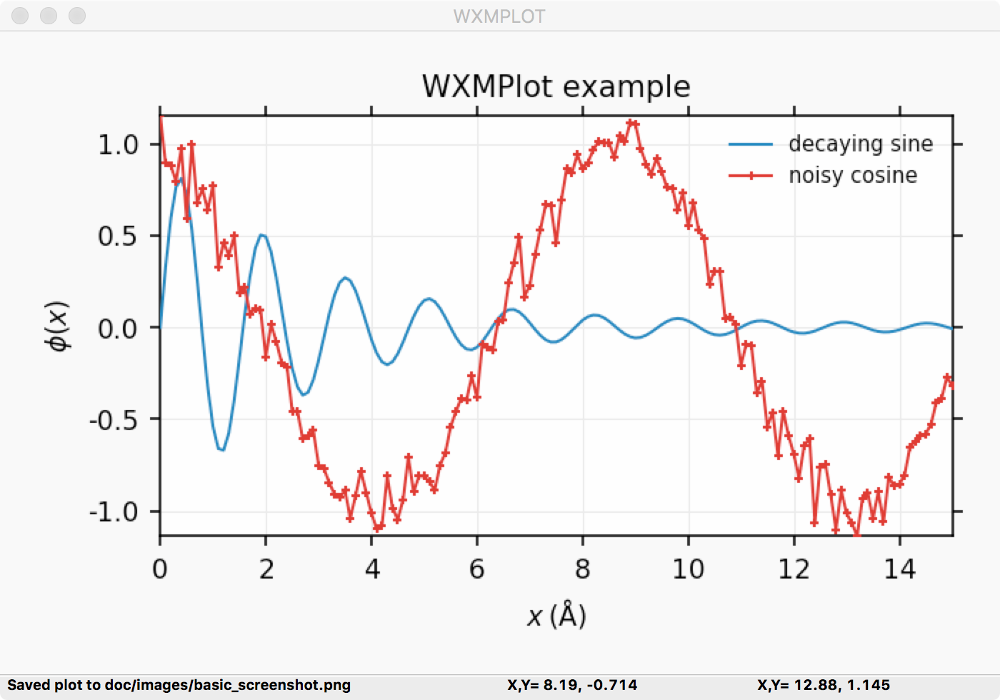
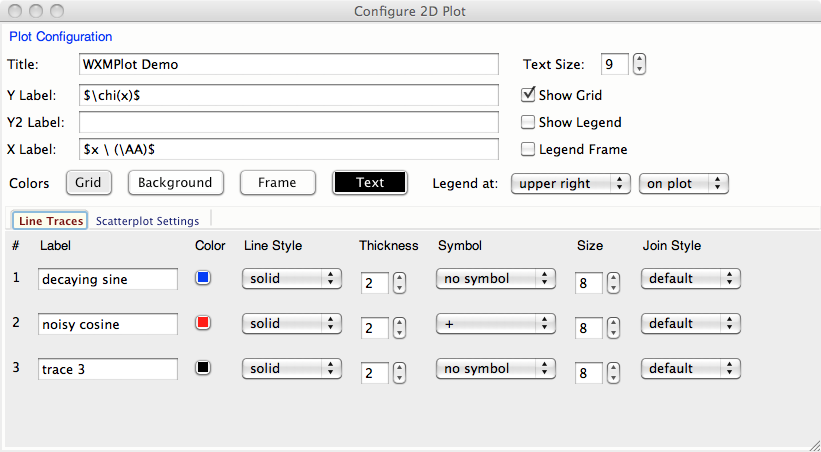
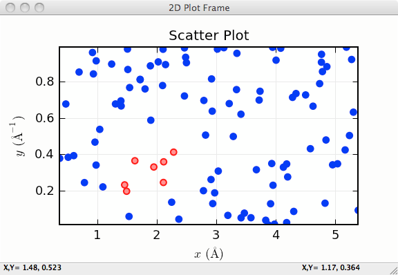
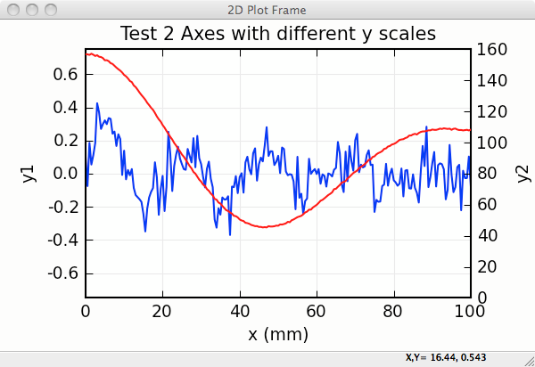

==========================================================
:class:`PlotPanel`:  A wx.Panel for Basic 2D Line Plots
==========================================================

.. module:: plotpanel

The :class:`PlotPanel` class supports standard 2 dimensional plots,
including line plots and scatter plots.  It has both an easy-to-use
programming interface, and a rich graphical user interface for manipulating
the plot after it has been drawn.  The :class:`PlotPanel` class is derived
from a :class:`wx.Panel` and so that it can be included anywhere in a wx
Windo object that a normal :class:`wx.Panel` can be.  In addition to
drawing a plot, a :class:`PlotPanel` provides the following capabilities to
the end-user:

   1. display x, y coordinates as the mouse move.
   2. display x, y coordinates of last left-click.
   3. zoom in on a particular region of the plot with left-drag in a
      lineplot, or draw an 'lasso' around selected points in a scatterplot.
   4. customize titles, labels, legend, colors, linestyles, markers, and
      whether a grid and a legend is shown.  A separate configuration
      window is used to give control of these settings.
   5. save high-quality plot images (as PNGs), or copy to system
      clipboard, or print.

In addition, there is a :class:`PlotFrame` widget which creates a
stand-alone :class:`wx.Frame` that contains a :class:`PlotPanel`, a
:class:`wx.StatusBar`, and a :class:`wx.MenuBar`.  Both :class:`PlotPanel`
and :class:`PlotFrame` classes have the basic plotting methods of
:meth:`plot` to make a new plot with a single trace, and :meth:`oplot` to
overplot another trace on top of an existing plot.  These each take 2
equal-length numpy arrays (abscissa, ordinate) for each trace, and a host
of optional arguments.  The :class:`PlotPanel` and :class:`PlotFrame` have
many additional methods to interact with the plots.

.. class:: PlotPanel(parent, size=(6.0, 3.7), dpi=96, messenger=None, show_config_popup=True, **kws)

   Create a Plot Panel, a :class:`wx.Panel`

   :param parent: wx parent object.
   :param size:   figure size in inches.
   :param dpi:    dots per inch for figure.
   :param messenger: function for accepting output messages.
   :type messenger: callable or ``None``
   :param show_config_popup: whether to enable a popup-menu on right-click.
   :type show_config_popup: ``True``/``False``

   The *size*, and *dpi* arguments are sent to matplotlib's
   :class:`Figure`.  The *messenger* should should be a function that
   accepts text messages from the panel for informational display.  The
   default value is to use :func:`sys.stdout.write`.

   The *show_config_popup* arguments controls whether to bind right-click
   to showing a poup menu with options to zoom in or out, configure the
   plot, or save the image to a file.

   Extra keyword parameters in ``**kws`` are sent to the wx.Panel.

:class:`PlotPanel` methods
=============================================

.. method:: plot(x, y, **kws)

   Draw a plot of the numpy arrays *x* and *y*, erasing any existing plot.  The
   displayed curve for these data is called a *trace*.  The :meth:`plot` method
   has many optional parameters, all using keyword/value argument.  Since most
   of these are shared with the :meth:`oplot` method, the full set of parameters
   is given in :ref:`Table of Plot Arguments <plotopt_table>`

.. method:: oplot(x, y, **kws)

   Draw a plot of the numpy arrays *x* and *y*, overwriting any existing plot.

   The :meth:`oplot` method has many optional parameters,  as listed in
   :ref:`Table of Plot Arguments <plotopt_table>`

.. _plotopt_table:

**Table of Plot Arguments** These arguments apply for the :meth:`plot`, :meth:`oplot`, and
:meth:`scatterplot` methods.  Except where noted, the arguments are available for :meth:`plot` and
:meth:`oplot`.  In addition, the :meth:`scatterplot` method uses many of the same arguments for the
same meaning, as indicated by the right-most column.

  +-------------+------------+---------+------------------------------------------------+-------------+
  | argument    |   type     | default | meaning                                        | scatterplot?|
  +=============+============+=========+================================================+=============+
  | title       | string     | None    | Plot title                                     |  yes        |
  +-------------+------------+---------+------------------------------------------------+-------------+
  | ylabel      | string     | None    | abscissa label                                 |  yes        |
  +-------------+------------+---------+------------------------------------------------+-------------+
  | y2label     | string     | None    | right-hand abscissa label                      |  yes        |
  +-------------+------------+---------+------------------------------------------------+-------------+
  | label       | string     | None    | trace label (defaults to 'trace N')            |  yes        |
  +-------------+------------+---------+------------------------------------------------+-------------+
  | side        | left/right | left    | side for y-axis and label                      |  yes        |
  +-------------+------------+---------+------------------------------------------------+-------------+
  | grid        | None/bool  | None    | to show grid lines                             |  yes        |
  +-------------+------------+---------+------------------------------------------------+-------------+
  | color       | string     | blue    | color to use for trace                         |  yes        |
  +-------------+------------+---------+------------------------------------------------+-------------+
  | use_dates   | bool       | False   | to show dates in xlabel (:meth:`plot` only)    |  no         |
  +-------------+------------+---------+------------------------------------------------+-------------+
  | linewidth   | int        | 2       | linewidth for trace                            |  no         |
  +-------------+------------+---------+------------------------------------------------+-------------+
  | style       | string     | solid   | line-style for trace (solid, dashed, ...)      |  no         |
  +-------------+------------+---------+------------------------------------------------+-------------+
  | drawstyle   | string     | line    | style connecting points of trace               |  no         |
  +-------------+------------+---------+------------------------------------------------+-------------+
  | marker      | string     | None    | symbol to show for each point (+, o, ....)     |  no         |
  +-------------+------------+---------+------------------------------------------------+-------------+
  | markersize  | int        | 8       | size of marker shown for each point            |  no         |
  +-------------+------------+---------+------------------------------------------------+-------------+
  | dy          | array      | None    | uncertainties for y values; error bars         |  no         |
  +-------------+------------+---------+------------------------------------------------+-------------+
  | ylog_scale  | bool       | False   | draw y axis with log(base 10) scale            |  no         |
  +-------------+------------+---------+------------------------------------------------+-------------+
  | xmin        | float      | None    | minimum displayed x value                      |  yes        |
  +-------------+------------+---------+------------------------------------------------+-------------+
  | xmax        | float      | None    | maximum displayed x value                      |  yes        |
  +-------------+------------+---------+------------------------------------------------+-------------+
  | ymin        | float      | None    | minimum displayed y value                      |  yes        |
  +-------------+------------+---------+------------------------------------------------+-------------+
  | ymax        | float      | None    | maximum displayed y value                      |  yes        |
  +-------------+------------+---------+------------------------------------------------+-------------+
  | autoscale   | bool       | True    | whether to automatically set plot limits       |  no         |
  +-------------+------------+---------+------------------------------------------------+-------------+
  | draw_legend | None/bool  | None    | whether to display legend (None: leave as is)  |  no         |
  +-------------+------------+---------+------------------------------------------------+-------------+
  | refresh     | bool       | True    | whether to refresh display                     |  no         |
  +-------------+------------+---------+------------------------------------------------+-------------+
  |             | **arguments that apply only for** :meth:`scatterplot`                 |             |
  +-------------+------------+---------+------------------------------------------------+-------------+
  | size        | int        | 10      | size of marker                                 |  yes        |
  +-------------+------------+---------+------------------------------------------------+-------------+
  | edgecolor   | string     | black   | edge color of marker                           |  yes        |
  +-------------+------------+---------+------------------------------------------------+-------------+
  | selectcolor | string     | red     | color for selected points                      |  yes        |
  +-------------+------------+---------+------------------------------------------------+-------------+
  | callback    | function   | None    | user-supplied callback to run on selection     |  yes        |
  +-------------+------------+---------+------------------------------------------------+-------------+

  As a general note, the configuration for the plot (title, labels, grid
  displays) and for each trace (color, linewidth, ...) are preserved for a
  :class:`PlotPanel`. A few specific notes:

   1. The title, label, and grid arguments to :meth:`plot` default to ``None``,
   which means to use the previously used value.

   2. The *use_dates* option is not very rich, and simply turns x-values that
   are Unix timestamps into x labels showing the dates.

   3. While the default is to auto-scale the plot from the data ranges,
   specifying any of the limits will override the corresponding limit(s).

   4. The *color* argument can be any color name ("blue", "red", "black", etc),
   standard X11 color names ("cadetblue3", "darkgreen", etc), or an RGB hex
   color string of the form "#RRGGBB".

   5. Valid *style* arguments are 'solid', 'dashed', 'dotted', or 'dash-dot',
   with 'solid' as the default.

   6. Valid *marker* arguments are '+', 'o', 'x', '^', 'v', '>', '<', '|', '_',
   'square', 'diamond', 'thin diamond', 'hexagon', 'pentagon', 'tripod 1', or
   'tripod 2'.

   7. Valid *drawstyles* are None (which connects points with a straight line),
   'steps-pre', 'steps-mid', or 'steps-post', which give a step between the
   points, either just after a point ('steps-pre'), midway between them
   ('steps-mid') or just before each point ('steps-post').   Note that if displaying
   discrete values as a function of time, left-to-right, and want to show a
   transition to a new value as a sudden step, you want 'steps-post'.

  All of these values, and a few more settings controlling whether and how to
  display a plot legend can be configured interactively (see Plot Configuration).

.. method:: update_trace(trace, x, y[, side='left'])

   update an existing trace.

   :param trace: integer index for the trace (0 is the first trace)
   :param x:     array of x values
   :param y:     array of y values
   :param side:  which y axis to use ('left' or 'right').

   This function is particularly useful for data that is changing and you
   wish to update traces from a previous :meth:`plot` or :meth:`oplot` with
   the new (x, y) data without completely redrawing the entire plot.  Using
   this method is substantially faster than replotting, and should be used
   for dynamic plots such as a StripChart.

.. method:: scatterplot(x, y, **kws)

   draws a 2d scatterplot.   This is a collection of points that are not meant to imply a specific
   order that can be connected by a continuous line.    A full list of arguments are listed in
   :ref:`Table of Plot Arguments <plotopt_table>`.

.. method:: clear()

   Clear the plot.

.. method:: add_text(text, x, y, side='left', rotation=None, ha='left', va='center', **kws)

   add text to the plot.

   :param text: text to write
   :param x:    x coordinate for text
   :param y:    y coordinate for text
   :param side: which axis to use ('left' or 'right') for coordinates.
   :param rotation:  text rotation: angle in degrees or 'vertical' or 'horizontal'
   :param ha:  horizontal alignment ('left', 'center', 'right')
   :param va:  vertical alignment ('top', 'center', 'bottom', 'baseline')

.. method:: add_arrow(x1, y1, x2, y2, side='left', shape='full', fg='black', wdith=0.01, head_width=0.1, overhang=0)

   draw arrow from (x1, y1) to (x2, y2).

   :param x1: starting x coordinate
   :param y1: starting y coordinate
   :param x2: endnig x coordinate
   :param y2: ending y coordinate
   :param side: which axis to use ('left' or 'right') for coordinates.
   :param shape:  arrow head shape ('full', 'left', 'right')
   :param fg:     arrow fill color ('black')
   :param width:  width of arrow line (in points. default=0.01)
   :param head_width:  width of arrow head (in points. default=0.1)
   :param overhang:    amount the arrow is swept back (in points. default=0)

.. method:: set_xylims(limits[, axes=None[, side=None[, autoscale=True]]])

   Set the x and y limits for a plot based on a 2x2 list.

   :param limits: x and y limits
   :type limits: a 4-element list: [xmin, xmax, ymin, ymax]
   :param axes: instance of matplotlib axes to use (i.e, for right or left side y axes)
   :param side: set to 'right' to get right-hand axes.
   :param autoscale: whether to automatically scale to data range.

   That is, if `autoscale=False` is passed in, then the limits are used.

.. method:: get_xylims()

   return current x, y limits.

.. method:: unzoom()

   unzoom the plot.  The x, y limits for interactive zooms are stored, and this function unzooms one level.

.. method:: unzoom_all()

   unzoom the plot to the full data range.

.. method:: set_title(title)

   set the plot title.

.. method:: set_xlabel(label)

   set the label for the ordinate axis.

.. method:: set_ylabel(label)

   set the label for the left-hand abscissa axis.

.. method:: set_y2label(label)

   set the label for the right-hand abscissa axis.

.. method:: set_bgcol(color)

   set the background color for the PlotPanel.

.. method:: write_message(message)

   write a message to the messenger.  For a :class:`PlotPanel` embedded in
   a :class:`PlotFrame`, this will go the the Status Bar.

.. method:: save_figure()

   shows a File Dialog to save a PNG image of the current plot.

.. method:: configure()

   show plot configuration window for customizing plot.

.. method:: reset_config()

   reset the configuration to default settings.

:class:`PlotFrame`: a wx.Frame showing a :class:`PlotPanel`
====================================================================

.. module:: plotframe

As mentioned above, a :class:`PlotFrame` is a wx.Frame -- a separate plot
window -- that contains a :class:`PlotPanel` and is decorated with a status
bar and menubar with menu items for saving, printing and configuring plots.
It inherits many of the methods of a :class:`PlotPanel`, and simply passes
the arguments along to the corresponding methods of the :class:`PlotPanel`.

.. class:: PlotFrame(parent[, size=(700, 450)[, title=None[, **kws]]])

   create a plot frame.  This frame will have a :data:`panel` member
   holding the underlying :class:`PlotPanel`, and have menus and statusbar
   for plot interaction.

.. method:: plot(x, y, **kws)

   Passed to panel.plot

.. method:: oplot(x, y, **kws)

   Passed to panel.oplot

.. method:: scatterplot(x, y, **kws)

   Passed to panel.scatterplot

.. method:: clear()

   Passed to panel.clear

.. method:: update_trace(x, y, **kws)

   Passed to panel.update_trace

.. method:: reset_config(x, y, **kws)

   Passed to panel.reset_config

:class:`PlotApp`: a wx.App showing a :class:`PlotFrame`
====================================================================

.. module:: plotapp

A :class:`PlotApp` is a wx.App -- an application -- that consists of a
:class:`PlotFrame`.  This show a frame that is decorated with a status bar
and menubar with menu items for saving, printing and configuring plots.

.. class:: PlotApp()

   create a plot application.  This has methods :meth:`plot`, :meth:`oplot`, and
   :meth:`write_message`, which are sent to the underlying :class:`PlotPanel`.
   This allows very simple scripts which give plot interactivity and
   customization.

Examples and Screenshots
====================================================================

Here, a few examples and screenshots of the output of those examples are
shown.

Basic Example
~~~~~~~~~~~~~~

A basic plot can be made using a :class:`PlotApp` and a simple script like this:

.. literalinclude:: ../examples/basic_screenshot.py

This gives a window with a plot that looks like this:

The configuration window (Options->Configuration or Ctrl-K) for this plot looks
like this:

where all the options and fields show will dynamically change the plot shown in the PlotPanel.

Scatterplot Example
~~~~~~~~~~~~~~~~~~~~~

An example scatterplot can be produced with a script like this:

.. literalinclude:: ../examples/scatterplot.py

and gives a plot (after having selected by "lasso"ing) that looks like this:

Using Left and Right Axes
~~~~~~~~~~~~~~~~~~~~~~~~~~~~

An example using both right and left axes with different scales can be
created with:

.. literalinclude:: ../examples/leftright.py

and gives a plot that looks like this:

More Examples
~~~~~~~~~~~~~~~

These and several other examples are given in the *examples* directory in
the source distribution kit.  The *demo.py* script there will show several
2D Plot panel examples, including a plot which uses a timer to simulate a
dynamic plot, updating the plot as fast as it can - typically 10 to 30
times per second, depending on your machine.  The *stripchart.py* example
script also shows a dynamic, time-based plot.

